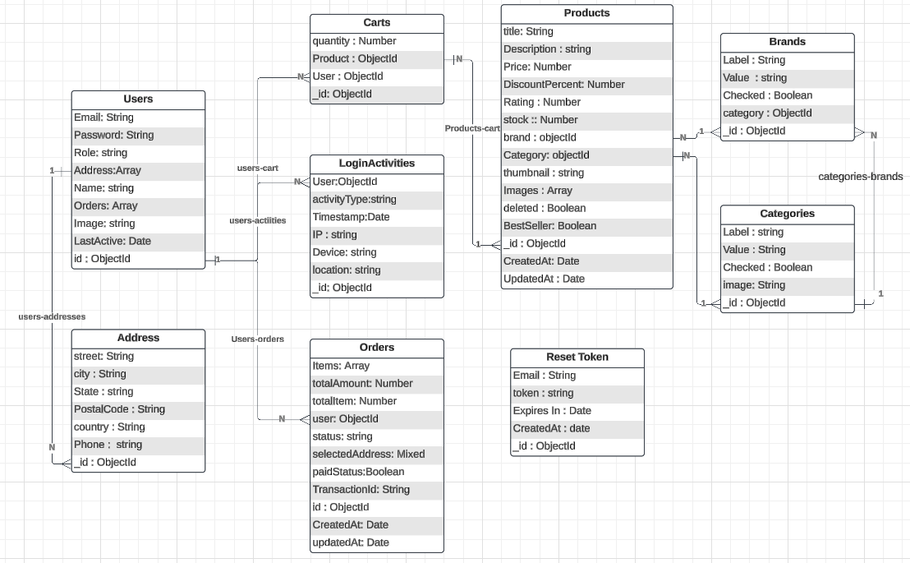

# ShopZen

shopZen is a comprehensive e-commerce platform that offers a seamless shopping experience for users along with a robust admin panel for backend management. On the user side, customers can register or log in, browse products with search and filter options, view detailed product pages, add items to their cart or wishlist, and securely checkout with multiple payment options. Users can manage their orders, track shipments, leave reviews, and receive notifications about offers and order updates. The admin panel empowers administrators to manage users, products, orders, and inventory efficiently. It includes tools for monitoring sales, generating reports, setting up discounts, handling customer support, and updating site content. With advanced analytics, security features, and content management, shopZen ensures a smooth operational flow while delivering a user-friendly shopping experience.

**Live demo :** https://ecommerceproject.com (will be available soon)
**YouTube Demo:** Watch Demo

**ERD :** 


## Acknowledgements

 - [Awesome Readme Templates](https://awesomeopensource.com/project/elangosundar/awesome-README-templates)
 - [Awesome README](https://github.com/matiassingers/awesome-readme)
 - [How to write a Good readme](https://bulldogjob.com/news/449-how-to-write-a-good-readme-for-your-github-project)


## API Reference

#### Get all items

```http
  GET /api/items
```

| Parameter | Type     | Description                |
| :-------- | :------- | :------------------------- |
| `api_key` | `string` | **Required**. Your API key |

#### Get item

```http
  GET /api/items/${id}
```

| Parameter | Type     | Description                       |
| :-------- | :------- | :-------------------------------- |
| `id`      | `string` | **Required**. Id of item to fetch |

#### add(num1, num2)

Takes two numbers and returns the sum.


## Appendix

Any additional information goes here

